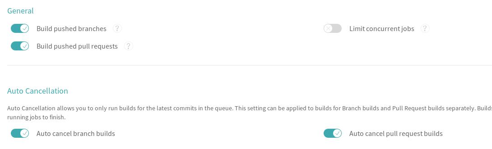

Sample Kotlin Library
==

[](https://search.maven.org/search?q=g:%22nz.co.senanque%22%20AND%20a:%22kotlin-library-template%22)
[](https://travis-ci.org/RogerParkinson/kotlin-library-template)

As part of picking up some Kotlin skills I needed to build a jar library file with Kotlin source files.
I'm coming from a Java/Maven/Eclipse skill set which I know pretty well and my Kotlin tool chain involves Gradle and AndroidStudio, derived from IntelliJ. So there is quite a lot different.

Still, the task is fundamentally the same.

* Compile the source into .class files
* Add the .class files to a .jar file
* Add manifest details to the jar file
* Get a pom.xml file somehow (it is manually created for Maven but generated here)
* Create a source jar file and a javadocs jar file
* Send all those to a local Maven repository
* Eventually publish them to Maven Central

Install Gradle
--

Initially I can ignore the IDE and just use Gradle from the command line, but I do have to install it.
Instructions are [here](https://linuxize.com/post/how-to-install-gradle-on-ubuntu-18-04/) for Ubuntu, which is what I am using. But the sequence is simple enough.
I already had Java installed, which is a prerequisite, so I only had to download Gradle

```bash
wget https://services.gradle.org/distributions/gradle-5.3.1-bin.zip -P /tmp
sudo unzip -d /opt/gradle /tmp/gradle-*.zip
```

That puts the files under /opt/gradle/gradle-5.3.1. Now there's a little bit of editing:

`sudo vi /etc/profile.d/gradle.sh`

And paste the following into the new file:

```bash
export GRADLE_HOME=/opt/gradle/gradle-5.0
export PATH=${GRADLE_HOME}/bin:${PATH}
```

Finally the next few commands:

```bash
sudo chmod +x /etc/profile.d/gradle.sh
source /etc/profile.d/gradle.sh
gradle -v
```

The last one should announce Gradle's version number etc. Mine looks like this:

```txt
Gradle 5.3.1

Build time:   2019-03-28 09:09:23 UTC
Revision:     f2fae6ba563cfb772c8bc35d31e43c59a5b620c3

Kotlin:       1.3.21
Groovy:       2.5.4
Ant:          Apache Ant(TM) version 1.9.13 compiled on July 10 2018
JVM:          1.8.0_45 (Oracle Corporation 25.45-b02)
OS:           Linux 4.15.0-46-generic amd64
```

Initial Project Creation
--

So, with Gradle installed I can create my initial project which I'll call Library. I'll create a directory for it first

```bash
mkdir kotlin-library-template
cd kotlin-library-template
```

The next command takes you into a prompt/response sequence

`gradle init --type=kotlin-application`

Starting a Gradle Daemon, 1 incompatible Daemon could not be reused, use --status for details

```txt
Select build script DSL:
  1: groovy
  2: kotlin
Enter selection (default: kotlin) [1..2] 1
Project name (default:  kotlin-library-template):  kotlin-library-template
Source package (default: kotlin.library.template): nz.co.senanque.library
BUILD SUCCESSFUL in 2m 11s
2 actionable tasks: 2 executed
```

I chose option 1 for the script DSL because I found more useful samples to copy from in that format. You can use either, of course, but they are different.

What this generates is a Gradle project with a sample source file and a sample test that calls it. The gradlew commands are in place, so is a build.gradle and a settings.gradle file. There is a .gitignore file there too which tells git to exclude the build directory and the .gradle directory. Because I plan to use Android Studio I edited it to exclude the following:

* .idea
* *.iml
* local.properties

This is what it looks like now:

```txt
.
├── build.gradle
├── gradle
│   └── wrapper
│       ├── gradle-wrapper.jar
│       └── gradle-wrapper.properties
├── gradlew
├── gradlew.bat
├── kotlin-library-template.iml
├── local.properties
├── settings.gradle
└── src
    ├── main
    │   ├── kotlin
    │   │   └── nz
    │   │       └── co
    │   │           └── senanque
    │   │               └── library
    │   │                   └── App.kt
    │   └── resources
    └── test
        ├── kotlin
        │   └── nz
        │       └── co
        │           └── senanque
        │               └── library
        │                   └── AppTest.kt
        └── resources

```

The .gitignore and .gradle entries are not shown but they are there. What is not there is a .git directory and we need that so:

`git init`

And now we have a local git repository. I have found when committing with Android Studio it needs a user name and email set up. I use something like this:

```bash
git config user.name RogerParkinson
git config user.email 3478501+RogerParkinson@users.noreply.github.com
```

Wait, what? Yes that's the email I want to use because I will eventually want to push this project to a github repository. [Github recommend](https://help.github.com/en/articles/about-commit-email-addresses) that you keep your real address private and they generate a no-reply email address they associate with your login there. Thats mine. It doesn't accept emails, but when I use it in a commit Github knows it is me. At this stage I create my github repository and push the files up there. I also added a Readme.md file.

Now is a good time to start up the Android Studio IDE and open the project. Android Studio, my version is 3.3, is still a rather strange beast to me. It likes to hide a lot of the files from the Project window. I can see the sense of hiding files I never want to see (such as .gitignore and the .idea directory) but it also hides the source, which is just weird. However it does have a setting which shows *all* the files, including .gitignore and .idea, that's 'Project Files' at the top left.


Customising the build.gradle file
--

This will build all right but it doesn't meet all my original goals so let's tackle those now. I need to add lots of things to the build.gradle file. First the plugins section. It needs to look like this:

```groovy
plugins {
    // Apply the Kotlin JVM plugin to add support for Kotlin on the JVM.
    id 'org.jetbrains.kotlin.jvm' version '1.3.21'
    id 'org.jetbrains.dokka' version '0.9.17'
    id 'java-library'
    id "de.marcphilipp.nexus-publish" version "0.2.0"
    id 'io.codearte.nexus-staging' version '0.11.0'

}
```

That included what I need to publish to a maven repository, as well as dokka which is Kotlin for Javadocs. I also define my group and version like this:

```groovy
group = "com.madurasoftware"
version = "0.0.1"
```

I also need to declare the repositories to pull my dependencies from:

```groovy
repositories {
    // Use jcenter for resolving your dependencies.
    // You can declare any Maven/Ivy/file repository here.
    jcenter()
    mavenCentral()
}
```

My actual dependencies are unchanged so far:

```groovy
dependencies {
    // Use the Kotlin JDK 8 standard library.
    implementation 'org.jetbrains.kotlin:kotlin-stdlib-jdk8'

    // Use the Kotlin test library.
    testImplementation 'org.jetbrains.kotlin:kotlin-test'

    // Use the Kotlin JUnit integration.
    testImplementation 'org.jetbrains.kotlin:kotlin-test-junit'
}
```

But now we get to the stuff that changed most. I want to publish my sources and Javadocs to maven in two jar files, that's what I normally do and here is what is needed for that:

```groovy
task sourcesJar(type: Jar) {
    archiveClassifier = 'sources'
    from sourceSets.main.allSource
}

task dokkaJar(type: Jar, dependsOn: dokka) {
    archiveClassifier = 'javadoc'
    from javadoc.destinationDir
}

dokka {
    outputFormat = 'javadoc'
    outputDirectory = javadoc.destinationDir
}
```

The first entry isn't too hard. It is gathering up all the source code into a jar file classifying it as 'sources'. The documentation is a bit more tricky. dokkaJar depends on the dokka task running. We don't need to define it as a task because it already has been defined in the plugih. But we do need to override its parameters. So we tell dokka we want html and where to put the output. The 'javadoc.DestinationDir' got defined in the maven-publish plugin I think, because there are some simpler ways of generating Javadocs for Java built into that. So, once dokka has run then dokkaJar can run. It does much the same as sourceJar in that it creates a jar file out of the 'from' directory spec.

At this point I have generated the files I want but I have not published them yet. Also I have not created a pom.xml file either. So I am only part way there.

But before I get any further I want to do something with the manifest in the main jar file I am generating, the one that holds the .class files. There is a jar task already there in the plugins, I just need to adjust some of its parameters like this:

```groovy
jar() {
    manifest {
        attributes(
                'Built-By'       : System.properties['user.name'],
                'Implementation-Title' : rootProject.name,
                'Implementation-Version': version,
                'Implementation-Vendor': 'Prometheus Consulting',
                'Build-Timestamp': new java.text.SimpleDateFormat("yyyy-MM-dd'T'HH:mm:ss.SSSZ").format(new Date()),
                'Created-By'     : "Gradle ${gradle.gradleVersion}",
                'Build-Jdk'      : "${System.properties['java.version']} (${System.properties['java.vendor']} ${System.properties['java.vm.version']})",
                'Build-OS'       : "${System.properties['os.name']} ${System.properties['os.arch']} ${System.properties['os.version']}"
        )
    }
}
```

That stamps the usual useful information in the jar file so people who want to look at it can see where it is from etc. 

The generated build.gradle file had a mainClassName entry which I removed. If I wanted it, and I generally don't for a library file, I would add it to the attributes above.

The next section is the actual publishing part which pulls it all together.

```groovy
publishing {
    publications {
        mavenJava(MavenPublication) {
            artifactId = 'kotlin-library-template'
            from components.java
            artifact sourceJar
            artifact dokkaJar
            versionMapping {
                usage('java-api') {
                    fromResolutionOf('runtimeClasspath')
                }
                usage('java-runtime') {
                    fromResolutionResult()
                }
            }
            pom {
                packaging = 'jar'
                name = 'My Library'
                description = 'A concise description of my library'
                url = 'http://www.madurasoftware.com'
                licenses {
                    license {
                        name = 'The Apache License, Version 2.0'
                        url = 'http://www.apache.org/licenses/LICENSE-2.0.txt'
                    }
                }
                developers {
                    developer {
                        id = 'rogerp'
                        name = 'Roger Parkinson'
                        email = 'roger.parkinson35 at gmail.com'
                    }
                }
                scm {
                    connection = 'scm:git:git@github.com:RogerParkinson/kotlin-library-template.git'
                    developerConnection = 'scm:git:git@github.com:RogerParkinson/kotlin-library-template.git'
                    url = 'scm:git:git@github.com:RogerParkinson/kotlin-library-template.git'
                }
            }
        }
    }
}
```

The first thing to notice about this is that there is a reference to sourcesJar and dokkaJar. These ensure those two jar file are published artifacts rather than just generated files. The 'from components.java' is misleading. It is the thing that picks up the .class files and puts them into the main jar file. It does this whether they are Java or Kotlin files.

The versionMapping section is described as [incubating](https://docs.gradle.org/current/dsl/org.gradle.api.publish.maven.MavenPublication.html) in the docs. I found that taking it out or leaving it in made no difference and there isn't a lot of information about it.

The pom section edits the settings I want into the pom file. Ther version and name etc are done automatically, but Maven Central needs the correct scm, licenses etc in there too.

I also need to *sign* these files because that is a requirement of maven central. For that I need to add this block to the gradle file:

```groovy
signing {
    sign publishing.publications
}
```

I found my build failed because I had made so many changes to the build.gradle file. I re-imported the project (File->Re-Import Gradle Project) and that problem went away. It was always fine on the command line *outside* the IDE, it failed on the command line inside the IDE though. Anyway a re-import fixed that.

Credentials
---

For the signing to work I need to have a gpg key set up and I need to specify it in the ~/.gradle/gradle.properties file. I also want to add my Sonatype credentials to that so this is what my file looks like

```txt
signing.keyId=F360573B
signing.password=******
signing.secretKeyRingFile=/home/roger/.gnupg/secring.gpg
nexusUsername = ****
nexusPassword = ********************************
```

Obviously I replace the `***` with my own values. Notice I specified the whole path of my keyring file.

This assumes I have myself registered with Sonatype and I have a user name and password there, although the values I give here are not the same as my manual login values. Sonatype generates an internal user/password for uploads and that is what I use here. There is also information about the gpg key I set up for signing my files. Files have to be signed in order to be valid for Maven Central.

The details on how to do all this are in the [Sonatype instructions](https://central.sonatype.org/pages/producers.html) and they are too long to repeat here. They are one-off things, though. I don't need to do them over and over.

Publishing
---

I use this gradle command to build:

`gradle -info build`

The build gives me a jar file in build/libs/kotlin-library-template-0.0.1.jar with a manifest that looks like this:

```txt
Manifest-Version: 1.0
Implementation-Title: kotlin-library-template
Implementation-Version: 0.0.1
Build-Timestamp: 2019-04-02T11:14:02.345+1300
Built-By: roger
Build-OS: Linux amd64 4.15.0-46-generic
Created-By: Gradle 5.3.1
Build-Jdk: 1.8.0_152-release (JetBrains s.r.o 25.152-b01)
Implementation-Vendor: Prometheus Consulting
```

But so far there was nothing published. That is because we don't want to publish on every local build. I can go to the command line and type:

`gradle -info publishToMavenLocal`

and then when I look inside my local maven repository (mine is ~/.m2/repository) I can see the files and their signatures. I don't need signatures in local maven but it is nice to see them there.

Next is to get it publishing to maven central. I need to refer to my Sonatype credentials in build.gradle:

```groovy
nexusPublishing {
    username = project.properties["nexusUsername"]
    password = project.properties["nexusPassword"]
}

nexusStaging {
    username = project.properties["nexusUsername"]
    password = project.properties["nexusPassword"]
    packageGroup = project.getGroup()
}
```

With that in place I just need to type

`gradle -info publishToNexus`

That will build the project and upload the artifacts into a Sonatype staging repository. I can log into Sonatype and work through the close and release steps and I'm done. Except I can make it a little easier by using the nexus-staging plugin as well. My command becomes:

`gradle -info publishToNexus closeAndReleaseRepository`

and I no longer need to log into Sonatype to finish things off. This is important for the next step which is to use Travis-ci to do my builds.

Travis-ci
---

Travis will trigger a build when I push to github, as long as I tell Github and Travis what I want. First I need to go into travis-ci and create a repository. Travis-ci already knows about all my github repositories because I pointed it at github when I registered. I can just tell it to start listening for changes to my github repository that holds my kotlin-library-template project:


I open settings and make it look like this (which is the default)



Next I have to create the script for Travis-ci to run, and that will need some environment variables. This is quite tricky because I need to sign my artifacts and I don't have my gpg configuration with my keys etc installed on the virtual machine that Travis-ci will spin up for me. It is really important that I don't copy that information somewhere public or anyone can sign my files as me, with obvious security problems. What to do?

There is more than one way to solve this. What I do is:

`gpg -a --export-secret-keys F360573B | base64 --wrap=0`

F360573B is my key id, yours will be different. It prompts for a pass phrase and then outputs a huge hex string. I save this value somewhere and call it GPG_SECRET_KEYS. I will refer to it again soon. Then I do this:

`gpg --export-ownertrust | base64 --wrap=0`

which gives me another long hex string I will save somewhere and call GPG_OWNERTRUST

Now I go back to the Travis-ci repository I created earlier and add the following environment variables with values:

* GPG_SECRET_KEYS
* GPG_OWNERTRUST
* GPG_PASSPHRASE
* SONATYPE_PASSWORD
* SONATYPE_USERNAME

Once that is done I need to provide a .travis.yml file in my project. This is the script file the build will use

```yml
language: java
jdk: oraclejdk8

before_install:
- echo $GPG_SECRET_KEYS | base64 --decode | gpg --import
- echo $GPG_OWNERTRUST | base64 --decode | gpg --import-ownertrust

install: ./gradlew -info build

deploy:
  provider: script
  script: "./gradlew -Psigning.keyId=F360573B -Psigning.password=$GPG_PASSPHRASE -PnexusUsername=$SONATYPE_USERNAME -PnexusPassword=$SONATYPE_PASSWORD -Psigning.secretKeyRingFile=$HOME/.gnupg/secring.gpg -x test clean build publishToNexus closeAndReleaseRepository"

  on:
    tags: true
```

The language and jdk lines at the top are just so that Travis-ci will configure itself properly. Then the before_install section tells gpg what my keys are, pulling the contents of the environment variables.

The install section is my basic script that runs the build and checks that it works.

So far everything in here will run whenever I do a git push to the repository.

The last section only runs when I *tag* the repository. So I might tag it with "1.2.3" and that will trigger this script, normal pushes won't trigger it. What it does is run another build, this time without running the tests which is safe because we just established that are working in the install phase. It then invokes two more steps which invoke publishing to nexus and then closing the repository when it is finished. The publishToNexus invokes the rest of the publish functionality so I get pom generation, cusomisation, signing etc all invoked from that. 

To make this work I need to go back and change some things. I want to be able to run the publish from the command line for testing, and then it can pick up credentials from gradle.properties. But when it runs under Travis-ci I want to supply those credentials from the environment variables. I also want the TRAVIS_TAG environment variable to dictate the version number. So the code around the version number near the top changes to:

```groovy
version = "0.0.1"

def travis_tag = "$System.env.TRAVIS_TAG"
if (travis_tag != "null") {
    version = travis_tag
}
```

And the publishing blocks change to:

```groovy
nexusPublishing {
    username = project.properties["nexusUsername"]
    password = project.properties["nexusPassword"]
}

nexusStaging {
    username = project.properties["nexusUsername"]
    password = project.properties["nexusPassword"]
    packageGroup = project.getGroup()
}
```

Now the code starts with a hard coded version but it also examines the TRAVIS_TAG environment variable and uses that if it has a value. That is set by Travis-ci if the build was triggered by setting a tag and it contains the tag.

So now, whenever I push the kotlin-library-template Travis-ci will kick off a build and verify it works, including passing tests. If I tag it with a version number it will build and publish the current source with that version number embedded.

There is a slight hole in this in that I don't have to update the version number when I release, I only have to tag. So if I forget to update the version number in build.gradle and someone pulls the code and looks at the version number they could be confused. But there are lots of other places I need to edit the version number during a release such as the release notes etc. I can cope with one more.